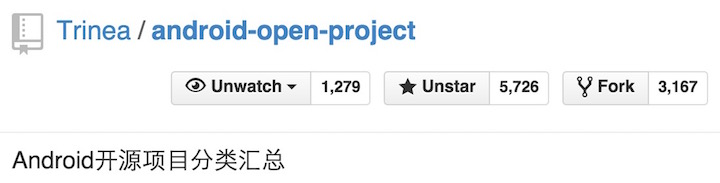
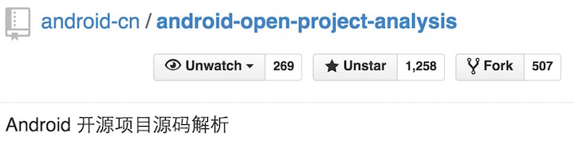

 
### 开源项目源码解析第一期成果
分析文档 | 介绍 
:------------- | :------------- 
[Volley 源码解析](http://codekk.com/open-source-project-analysis/detail/Android/grumoon/Volley%20%E6%BA%90%E7%A0%81%E8%A7%A3%E6%9E%90) | Google 官方推出的 Android 网络数据传输框架
[Universal Image Loader 源码解析](http://codekk.com/open-source-project-analysis/detail/Android/huxian99/Android%20Universal%20Image%20Loader%20%E6%BA%90%E7%A0%81%E5%88%86%E6%9E%90) | 使用最广泛的 Android 图片缓存
[Dagger 源码解析](http://codekk.com/open-source-project-analysis/detail/Android/%E6%89%94%E7%89%A9%E7%BA%BF/Dagger%20%E6%BA%90%E7%A0%81%E8%A7%A3%E6%9E%90) | 堪与 Guice 比肩的依赖注入框架
[EventBus 源码解析](http://codekk.com/open-source-project-analysis/detail/Android/Trinea/EventBus%20%E6%BA%90%E7%A0%81%E8%A7%A3%E6%9E%90) | 与 Otto 为 Android 端使用最广泛的事件发布/订阅框架
[xUtils 源码解析](http://codekk.com/open-source-project-analysis/detail/Android/Caij/xUtils%20%E6%BA%90%E7%A0%81%E8%A7%A3%E6%9E%90) | 包含网络请求、图片缓存、数据库 ORM 等的工具库
[ViewPagerindicator 源码解析](http://codekk.com/open-source-project-analysis/detail/Android/lightSky/ViewPagerindicator%20%E6%BA%90%E7%A0%81%E8%A7%A3%E6%9E%90) | 使用最广泛的界面导航指示器
[HoloGraphLibrary 源码解析](http://codekk.com/open-source-project-analysis/detail/Android/AaronPlay/HoloGraphLibrary%20%E6%BA%90%E7%A0%81%E8%A7%A3%E6%9E%90) | 一个支持线状图、柱状图、饼状图的图表绘制项目
[CircularFloatingActionMenu 源码解析](http://codekk.com/open-source-project-analysis/detail/Android/cpacm/CircularFloatingActionMenu%20%E6%BA%90%E7%A0%81%E8%A7%A3%E6%9E%90) | 与著名应用 Path 类似的弹出菜单
[PhotoView 源码解析](http://codekk.com/open-source-project-analysis/detail/Android/dkmeteor/PhotoView%20%E6%BA%90%E7%A0%81%E8%A7%A3%E6%9E%90) | 支持双击或双指缩放的 ImageView
[Lock Pattern 源码解析](http://codekk.com/open-source-project-analysis/detail/Android/%E7%88%B1%E6%97%A9%E8%B5%B7/Android%20Lock%20Pattern%20%E6%BA%90%E7%A0%81%E8%A7%A3%E6%9E%90) | 图案密码解锁库
[公共技术点之 Java 动态代理](http://codekk.com/open-source-project-analysis/detail/Android/Caij/Java%20%E5%8A%A8%E6%80%81%E4%BB%A3%E7%90%86) | Java 动态代理
[公共技术点之 View 绘制流程](http://codekk.com/open-source-project-analysis/detail/Android/lightSky/View%20%E7%BB%98%E5%88%B6%E6%B5%81%E7%A8%8B) | View 绘制流程
[公共技术点之 Java 注解](http://codekk.com/open-source-project-analysis/detail/Android/Trinea/Java%20%E6%B3%A8%E8%A7%A3%20Annotation) | Java 注解
[公共技术点之依赖注入](http://www.codekk.com/open-source-project-analysis/detail/Android/%E6%89%94%E7%89%A9%E7%BA%BF/%E4%BE%9D%E8%B5%96%E6%B3%A8%E5%85%A5) | 依赖注入
[公共技术点之 View 事件传递](http://www.codekk.com/open-source-project-analysis/detail/Android/Trinea/View%20%E4%BA%8B%E4%BB%B6%E4%BC%A0%E9%80%92) | View 事件传递

### 后续
* 我们会分析更多开源库的源码  
* 我们会将类似开源库从原理上进行对比，介绍优劣及适用场景  
 
#### 我们会将 Star 近 6K 的`Android 开源汇总项目`和这个`源码解析项目`结合起来  
#### 做到主要开源库都有对应原理解析文档并维护更新。 

  
  

#### 我们相信在开源库越来越繁多的情况下，开源库的使用也会越来越好。
